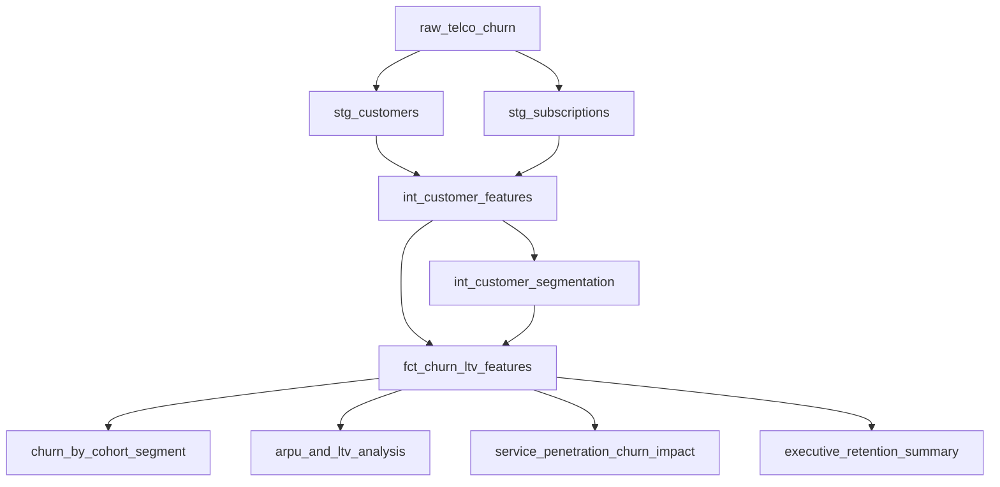

# SQL Architecture & Schema Guide

**Project**: Customer Churn Prediction & LTV Engine  
**Author**: Abhishek (SQL & Feature Engineering)

---

## 1. SQL Layer Architecture

The SQL transformation layer is structured following modern analytics engineering best practices (ELT paradigm, dbt-compatible modular structure):

---

## 2. Directory Structure & Execution Order

1. **`sql/staging/`**: Ingestion & Sanitization
   - `stg_customers.sql`: Ingests customer demographic attributes and casts `MonthlyCharges` & `TotalCharges` safely.
   - `stg_subscriptions.sql`: Normalizes internet, phone, VAS add-ons, and payment method indicators.
2. **`sql/transformations/`**: Intermediate & Fact Mart
   - `int_customer_features.sql`: Joins customer + subscription records; creates tenure cohorts, charge velocity, and service bundle flags.
   - `int_customer_segmentation.sql`: Assigns behavioral risk tiers, monetary value tiers, and strategic action categories.
   - `fct_churn_ltv_features.sql`: Unified wide feature mart table ready for ML training and downstream analytics.
3. **`sql/analytics/`**: Executive & Business Queries
   - `churn_by_cohort_segment.sql`: Cohort churn rates and lost MRR.
   - `arpu_and_ltv_analysis.sql`: ARPU and realized vs projected LTV.
   - `service_penetration_churn_impact.sql`: Attach rate correlation with retention odds.
   - `executive_retention_summary.sql`: Executive KPI summary scorecard.
